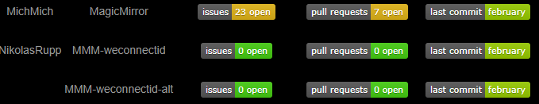

[](https://github.com/NikolasRupp/MMM-git-badges/blob/master/LICENSE)

# MMM-git-badges

A module to integrate Information from Github and Gitlab into the [MagicMirror](https://github.com/MichMich/MagicMirror).

- [Usage](#usage)
- [Pictures](#pictures)

## I'am a beginner at Programming so I think there are a lot of better ways to implement it. Feel free to send an merge request.

## Usage

### Installation

- To use this module, clone this repository to your __modules__ folder of your MagicMirror:

```
cd ~/MagicMirror/modules
git clone https://github.com/NikolasRupp/MMM-git-badges.git
```

- Now just add the module to your config.js file ([config entries](#configuration)).

### Configuration

The module needs the default configuration block in your config.js to work.

```javascript
{
  module: 'MMM-weconnectid',
  position: "top_left",
  config: {
    conf: [{"user":"MichMich","repo":"MagicMirror","service":"github","fields":["issues","pull_requests","last_commit"]}],
    height: "20px",
    minWidth: "150px",
    updateInterval: 600000,
  }
},
```

The following properties can be configured:

|Option|Description|Options|Default|Required|Type|
|---|---|---|---|---|---|
|conf|Configuration of what should be shown|-|[{"user":"MichMich","repo":"MagicMirror","service":"github","fields":["issues","requests","last_commit"]}]|yes|Array|
|height|Height of the badges|Any px value|"20px"|no|String|
|minWidth|Min width of each column. If the badge is wider it will make the column wider|Any px value|"150px"|no|String|
|updateInterval|How often should it be updated|Nay number|600000|no|Number|

Each conf entry has to have the following Attributes:

|Value|Description|Options|
|---|---|---|
|user|Username of the Owner if the Repository|-|
|repo|Name of the Repository|-|
|service|Which git service|github,gitlab|
|fields|Which badges should be shown|See [Fields](#fields)


#### Fields

You can define which fields you want to see. It has to be an Array.

The following Attributes are available:

|Value|Description|Github|Gitlab|
|---|---|---|---|
|license|License of the Repository|x|x|
|release|Release version|x|x|
|downloads|Downloads of the Release|x||
|release_date|Release date|x||
|forks|Number of forks|x|x|
|stars|Number of Stars|x|x|
|watchers|Number of Watchers|x||
|issues|Number of open Issues|x|x|
|requests|Number of pull/merge requests|x|x|
|commit_activity|Number of commits per Month|x||
|last_commit|Last commit date|x|x|
|contributors|Number of Contributors|x|x|
|files|Number of files in the Repository|x||
|size|Size of the Repository|x||

## Pictures


